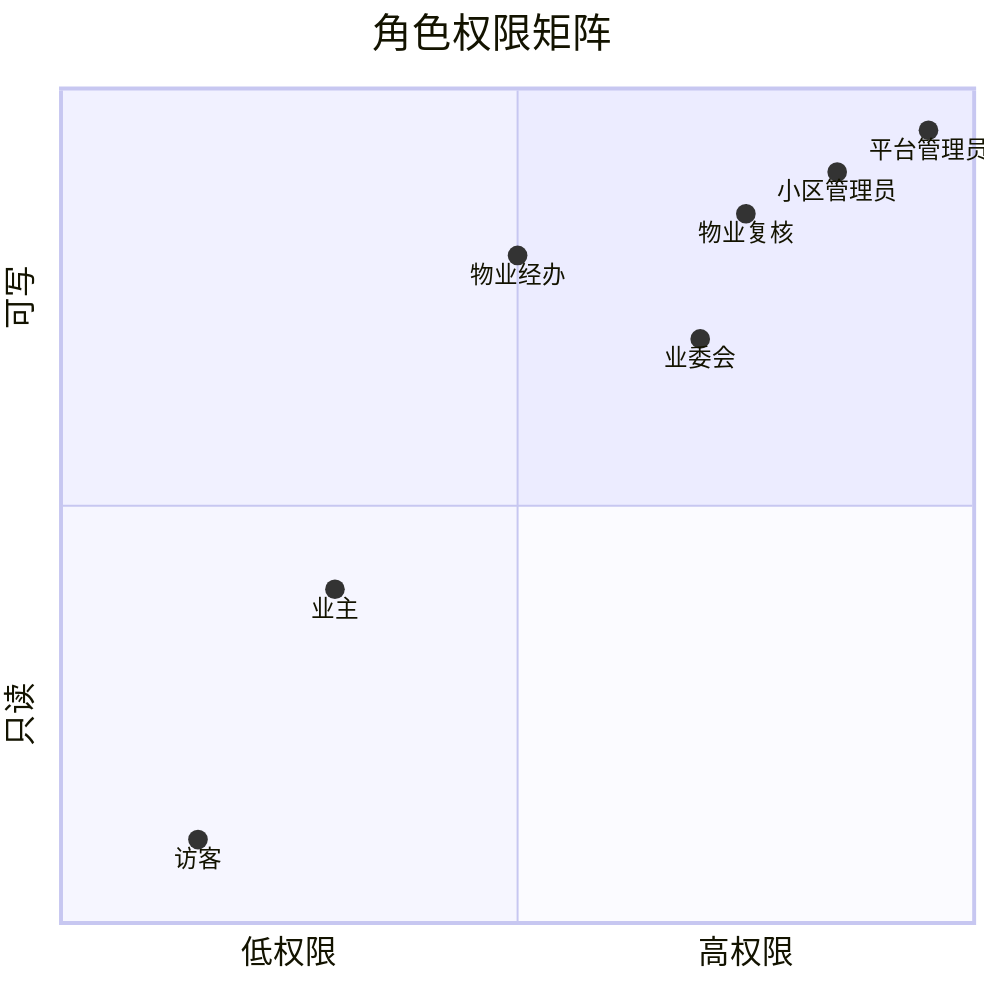
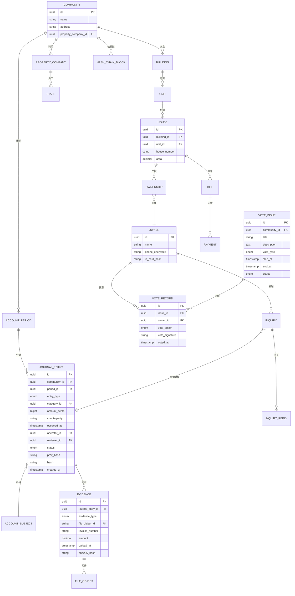
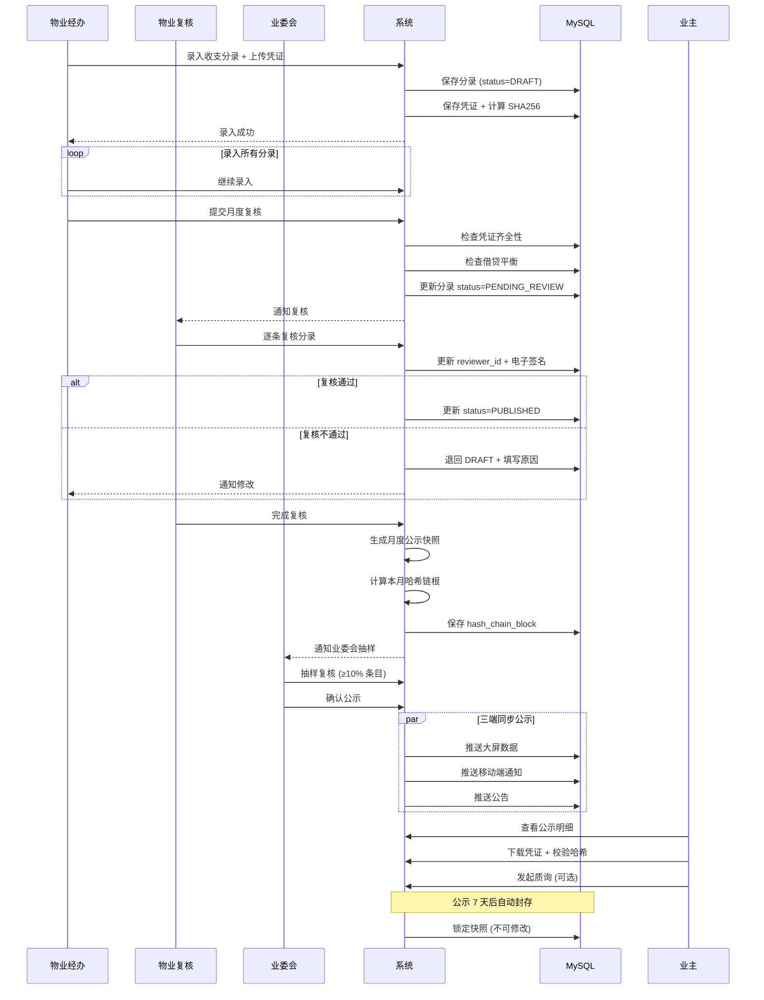
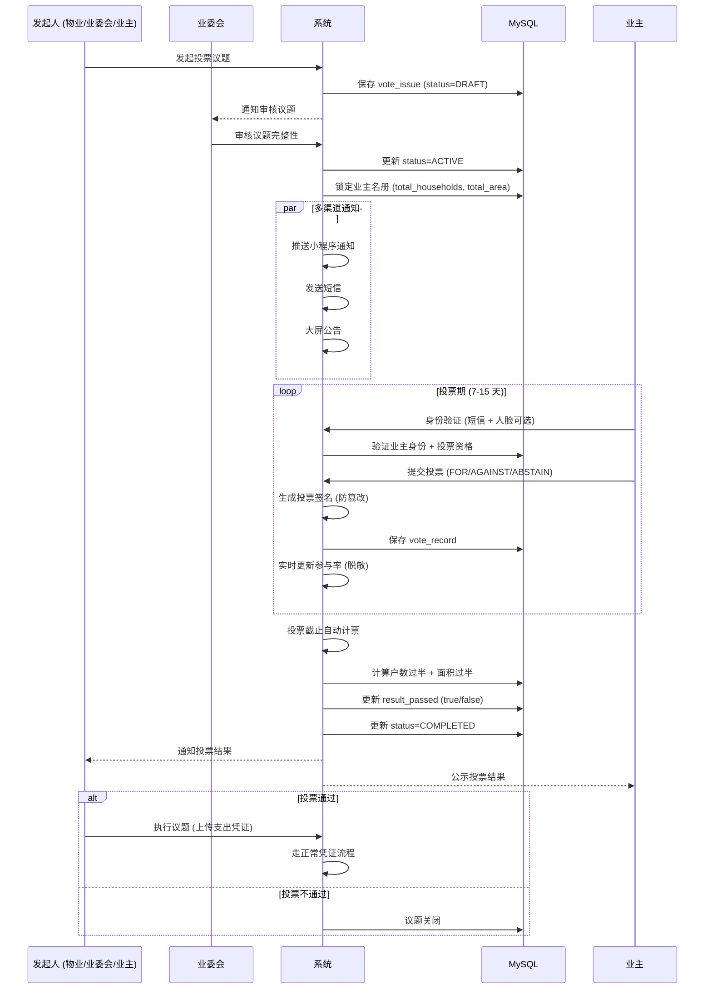
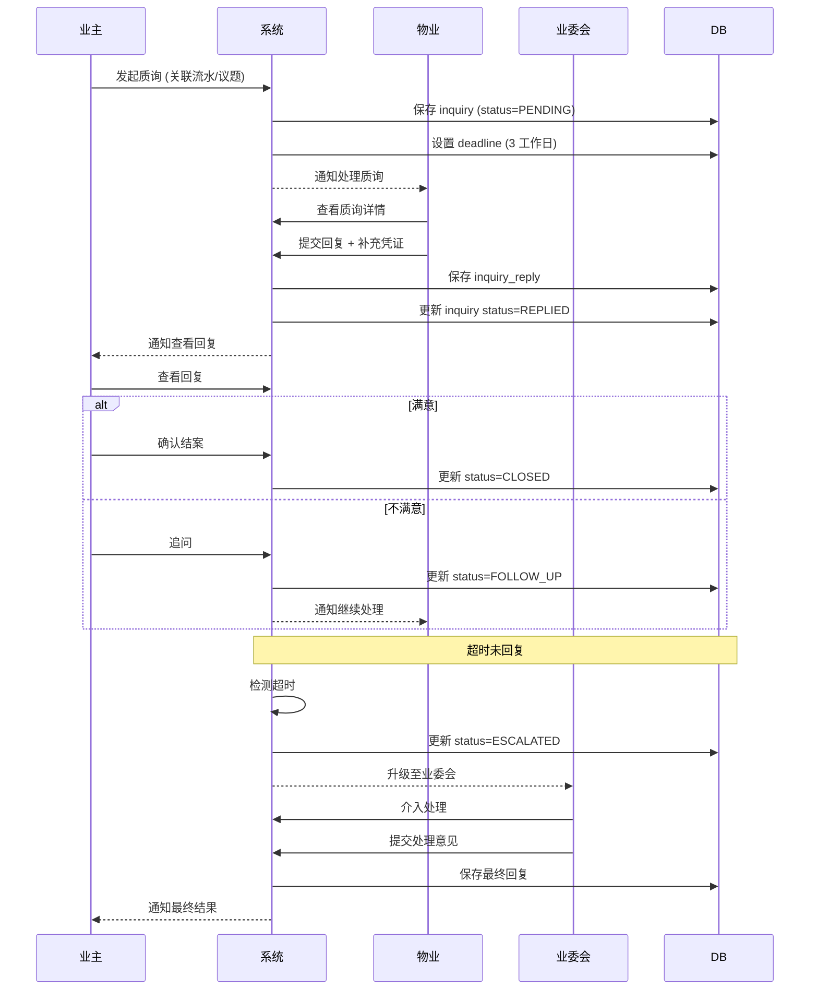
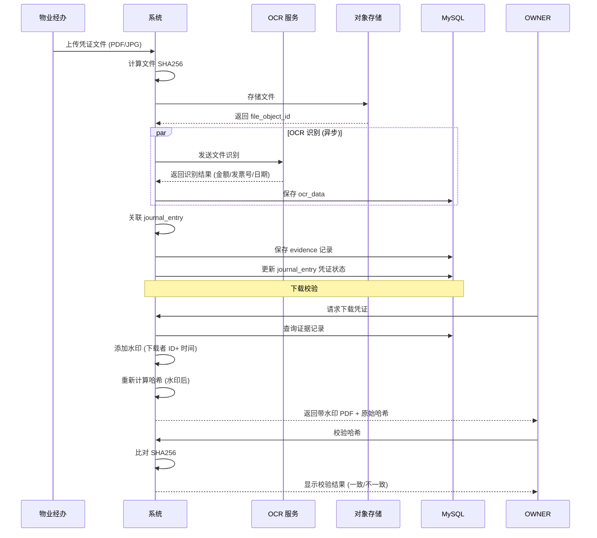
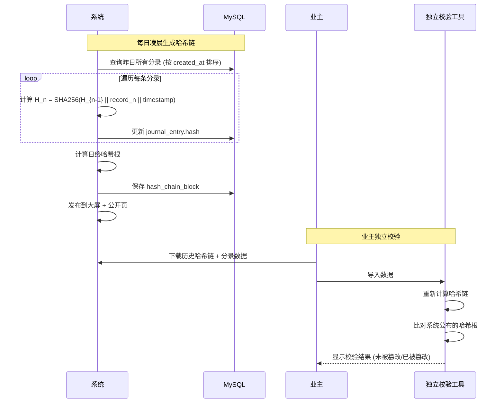
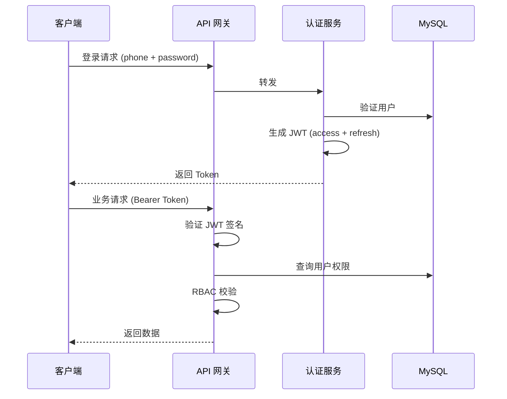
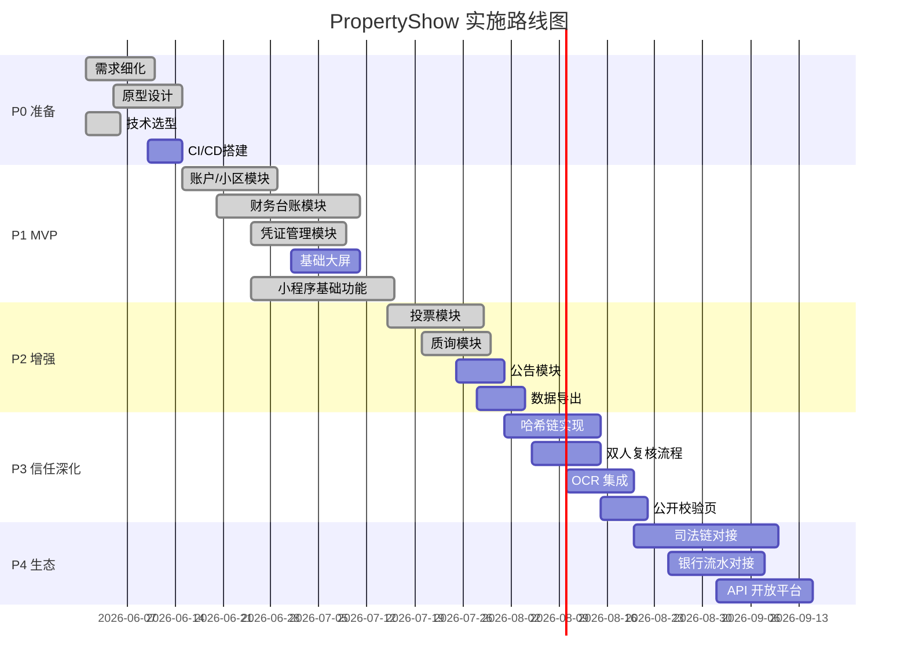
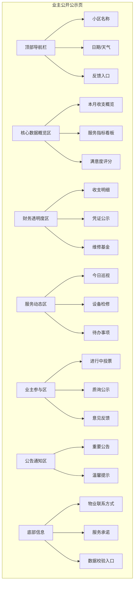

# 物业透明化系统 · 系统设计文档 (v1.0)

> **项目名称**: PropertyShow (物业透明化系统)  
> **文档版本**: v1.0  
> **最后更新**: 2026-06-05  
> **技术栈**: Vue 3 + Vite + 微信小程序 + NestJS + MySQL 8

---

## 目录

1. [系统概述](#1-系统概述)
2. [技术架构](#2-技术架构)
3. [业务架构](#3-业务架构)
4. [数据架构](#4-数据架构)
5. [核心业务流程](#5-核心业务流程)
6. [API 设计](#6-api-设计)
7. [安全设计](#7-安全设计)
8. [部署架构](#8-部署架构)
9. [架构决策记录 (ADR)](#9-架构决策记录 adr)
10. [实施路线图](#10-实施路线图)

---

## 1. 系统概述

### 1.1 业务背景

小区物业与业主之间存在严重的信任危机，主要体现为：
- 公示信息无依据、数据可疑
- 物业收入支出不透明
- 业主无法参与决策
- 质询无门、反馈石沉大海

### 1.2 系统目标

构建一个**全流程可溯源、数据可验证、业主可参与**的物业透明化系统，重建物业与业主之间的信任关系。

### 1.3 核心功能

| 模块 | 功能 | 用户 |
|------|------|------|
| 财务台账 | 收入/支出录入、凭证上传、月度结账 | 物业人员 |
| 公示大屏 | 实时展示收支、投票、公告 | 业主/访客 |
| 业主共治 | 投票、质询、议题发起 | 业主 |
| 物业费管理 | 账单生成、在线缴费、欠费统计 | 物业/业主 |
| 审计防篡改 | 哈希链存证、双人复核、异常检测 | 业委会/平台 |

### 1.4 用户角色



---

## 2. 技术架构

### 2.1 技术选型总览

| 层级 | 技术 | 版本 | 选型理由 |
|------|------|------|----------|
| **前端 (Web)** | Vue 3 + Vite | 3.x | 现代前端框架、快速开发、良好的开发者体验 |
| **前端 (小程序)** | 微信小程序原生 | - | 原生开发性能更好、功能更丰富、无需额外编译 |
| **前端 (大屏)** | Vue 3 + DataV | 3.x | 大屏可视化组件丰富 |
| **后端框架** | NestJS | 10.x | TypeScript、模块化、依赖注入、易测试 |
| **数据库** | MySQL | 8.x | 成熟稳定、团队熟悉、事务支持好 |
| **缓存** | Redis | 7.x | 高性能缓存、会话管理 |
| **对象存储** | MinIO / 阿里云 OSS | - | 凭证文件存储 |
| **消息队列** | Redis Streams | - | 异步任务、审计日志 |
| **API 文档** | Swagger/OpenAPI | 3.0 | 自动生成、在线调试 |
| **部署** | Docker + K8s | - | 容器化、弹性伸缩 |

### 2.2 系统架构图

```mermaid
C4Context
    title 物业透明化系统 - 系统上下文图

    Person(owner, "业主", "查看公示、参与投票、发起质询")
    Person(property_staff, "物业人员", "录入收支、上传凭证、发布公告")
    Person(committee, "业委会", "监督审核、发起议题、复核大额支出")
    Person(platform_admin, "平台管理员", "小区审核、系统配置、审计")

    System_Boundary(system, "物业透明化系统") {
        Container(mobile_app, "微信小程序", "微信原生", "业主/物业人员操作入口")
        Container(web_app, "Web 网页端", "Vue3 + Vite", "管理后台、大屏管理")
        Container(big_screen, "公示大屏", "Vue3 + DataV", "小区公共区域展示")
        Container(api_gateway, "API 网关", "Nginx", "路由、限流、鉴权")
        
        Container_Boundary(backend, "后端服务 (NestJS)") {
            Container(auth_svc, "认证授权服务", "NestJS", "JWT、RBAC")
            Container(ledger_svc, "财务台账服务", "NestJS", "收支管理、凭证")
            Container(governance_svc, "业主共治服务", "NestJS", "投票、质询")
            Container(disclosure_svc, "公示服务", "NestJS", "大屏数据、公告")
            Container(audit_svc, "审计服务", "NestJS", "哈希链、异常检测")
        }

        Db(mysql, "MySQL 8", "主从复制、读写分离")
        Db(redis, "Redis 7", "缓存、会话、消息队列")
        Storage(oss, "对象存储", "MinIO/OSS", "凭证文件")
    }

    Rel(owner, mobile_app, "使用")
    Rel(property_staff, mobile_app, "使用")
    Rel(property_staff, web_app, "使用")
    Rel(committee, mobile_app, "使用")
    Rel(committee, web_app, "使用")
    Rel(platform_admin, web_app, "管理")
    
    Rel(mobile_app, api_gateway, "HTTPS")
    Rel(web_app, api_gateway, "HTTPS")
    Rel(big_screen, api_gateway, "HTTPS")
    Rel(api_gateway, auth_svc, "路由")
    Rel(api_gateway, ledger_svc, "路由")
    Rel(api_gateway, governance_svc, "路由")
    Rel(api_gateway, disclosure_svc, "路由")
    Rel(api_gateway, audit_svc, "路由")
    
    Rel(auth_svc, mysql, "读写")
    Rel(ledger_svc, mysql, "读写")
    Rel(governance_svc, mysql, "读写")
    Rel(disclosure_svc, mysql, "读")
    Rel(audit_svc, mysql, "读写")
    
    Rel(ledger_svc, redis, "缓存热点数据")
    Rel(disclosure_svc, redis, "缓存大屏数据")
    Rel(auth_svc, redis, "存储会话")
    
    Rel(ledger_svc, oss, "存储凭证")
    Rel(audit_svc, oss, "读取凭证哈希")

    UpdateRelStyle(owner, mobile_app, $offsetY="-40")
    UpdateRelStyle(property_staff, mobile_app, $offsetX="40")
    UpdateRelStyle(committee, mobile_app, $offsetY="40")
```

### 2.3 分层架构

```mermaid
graph TB
    subgraph "展示层 (Presentation Layer)"
        A1[微信小程序]
        A2[Vue3 Web 网页端]
        A3[Vue3 公示大屏]
    end

    subgraph "网关层 (Gateway Layer)"
        B1[Nginx API 网关]
        B2[限流/鉴权/日志]
    end

    subgraph "应用层 (Application Layer)"
        C1[认证授权模块]
        C2[财务管理模块]
        C3[业主共治模块]
        C4[公示服务模块]
        C5[审计服务模块]
    end

    subgraph "领域层 (Domain Layer)"
        D1[实体: JournalEntry]
        D2[实体: Evidence]
        D3[实体: Vote]
        D4[实体: Inquiry]
        D5[值对象: Money]
        D6[领域服务: HashChain]
    end

    subgraph "基础设施层 (Infrastructure Layer)"
        E1[MySQL Repository]
        E2[Redis Cache]
        E3[OSS Storage]
        E4[Message Queue]
    end

    A1 --> B1
    A2 --> B1
    A3 --> B1
    
    B1 --> C1
    B1 --> C2
    B1 --> C3
    B1 --> C4
    B1 --> C5
    
    C1 --> D1
    C2 --> D1
    C2 --> D2
    C3 --> D3
    C3 --> D4
    C5 --> D6
    
    C1 --> E1
    C2 --> E1
    C3 --> E1
    C4 --> E1
    C5 --> E1
    
    C2 --> E2
    C4 --> E2
    C2 --> E3
    C5 --> E4

    UpdateLayoutConfig($c4ShapeInRow="3", $c4BoundaryInRow="1")
```

### 2.4 NestJS 模块结构

```
src/
├── common/                    # 公共模块
│   ├── decorators/           # 自定义装饰器
│   ├── filters/              # 异常过滤器
│   ├── guards/               # 权限守卫
│   ├── interceptors/         # 拦截器
│   └── pipes/                # 管道
│
├── modules/
│   ├── auth/                 # 认证授权模块
│   │   ├── auth.controller.ts
│   │   ├── auth.service.ts
│   │   ├── strategies/       # JWT 策略
│   │   └── dto/
│   │
│   ├── community/            # 小区管理模块
│   │   ├── community.controller.ts
│   │   ├── community.service.ts
│   │   ├── entities/
│   │   └── dto/
│   │
│   ├── ledger/               # 财务台账模块
│   │   ├── ledger.controller.ts
│   │   ├── ledger.service.ts
│   │   ├── entities/
│   │   ├── hash-chain.service.ts
│   │   └── dto/
│   │
│   ├── governance/           # 业主共治模块
│   │   ├── vote.controller.ts
│   │   ├── vote.service.ts
│   │   ├── inquiry.controller.ts
│   │   ├── inquiry.service.ts
│   │   └── dto/
│   │
│   ├── disclosure/           # 公示服务模块
│   │   ├── disclosure.controller.ts
│   │   ├── disclosure.service.ts
│   │   └── dto/
│   │
│   └── audit/                # 审计服务模块
│       ├── audit.controller.ts
│       ├── audit.service.ts
│       └── anomaly-detection.service.ts
│
├── database/                 # 数据库配置
│   ├── typeorm.config.ts
│   └── migrations/
│
└── main.ts
```

---

## 3. 业务架构

### 3.1 核心业务域

```mermaid
graph LR
    subgraph "业主端"
        A1[查看公示]
        A2[参与投票]
        A3[发起质询]
        A4[查看账单]
    end

    subgraph "物业端"
        B1[录入收支]
        B2[上传凭证]
        B3[发布公告]
        B4[生成账单]
    end

    subgraph "业委会"
        C1[审核收支]
        C2[发起议题]
        C3[监督质询]
        C4[复核大额]
    end

    subgraph "平台"
        D1[小区审核]
        D2[数据审计]
        D3[系统配置]
    end

    A1 -.->|数据来源于 | B1
    A2 -.->|投票对象 | C2
    A3 -.->|质询对象 | B1
    C1 -.->|审核 | B2
    C4 -.->|复核 | B1
    D2 -.->|审计 | C1

    UpdateLayoutConfig($c4ShapeInRow="4")
```

### 3.2 财务科目体系

```mermaid
graph TD
    subgraph "收入科目"
        A1[物业费收入]
        A2[停车费收入]
        A3[广告位收入]
        A4[场地租赁]
        A5[维修基金利息]
        A6[其他收入]
    end

    subgraph "支出科目"
        B1[人员工资]
        B2[保洁服务]
        B3[绿化养护]
        B4[安保服务]
        B5[设备维保]
        B6[能耗费用]
        B7[维修支出]
        B8[行政办公]
        B9[税费]
    end

    UpdateLayoutConfig($c4ShapeInRow="3")
```

---

## 4. 数据架构

### 4.1 核心 ER 图



### 4.2 核心表结构

#### 4.2.1 财务分录表 (journal_entry)

```sql
CREATE TABLE journal_entry (
    id VARCHAR(36) PRIMARY KEY,
    community_id VARCHAR(36) NOT NULL,
    period_id VARCHAR(36) NOT NULL,
    entry_type ENUM('INCOME', 'EXPENSE', 'TRANSFER') NOT NULL,
    category_id VARCHAR(36) NOT NULL,
    amount_cents BIGINT NOT NULL,
    counterparty VARCHAR(255) NOT NULL,
    description TEXT,
    occurred_at TIMESTAMP NOT NULL,
    operator_id VARCHAR(36) NOT NULL,
    reviewer_id VARCHAR(36),
    committee_id VARCHAR(36),
    status ENUM('DRAFT', 'PENDING_REVIEW', 'PUBLISHED', 'VOIDED') NOT NULL DEFAULT 'DRAFT',
    voided_by_entry_id VARCHAR(36),
    prev_hash VARCHAR(64),
    hash VARCHAR(64) NOT NULL,
    created_at TIMESTAMP NOT NULL DEFAULT CURRENT_TIMESTAMP,
    updated_at TIMESTAMP NOT NULL DEFAULT CURRENT_TIMESTAMP ON UPDATE CURRENT_TIMESTAMP,
    
    INDEX idx_community_period (community_id, period_id),
    INDEX idx_occurred_at (occurred_at),
    INDEX idx_status (status),
    INDEX idx_hash (hash),
    
    FOREIGN KEY (community_id) REFERENCES community(id),
    FOREIGN KEY (period_id) REFERENCES account_period(id),
    FOREIGN KEY (category_id) REFERENCES account_subject(id),
    FOREIGN KEY (operator_id) REFERENCES staff(id),
    FOREIGN KEY (reviewer_id) REFERENCES staff(id),
    FOREIGN KEY (voided_by_entry_id) REFERENCES journal_entry(id)
) ENGINE=InnoDB DEFAULT CHARSET=utf8mb4 COLLATE=utf8mb4_unicode_ci;
```

#### 4.2.2 凭证表 (evidence)

```sql
CREATE TABLE evidence (
    id VARCHAR(36) PRIMARY KEY,
    journal_entry_id VARCHAR(36) NOT NULL,
    evidence_type ENUM('INVOICE', 'CONTRACT', 'RECEIPT', 'PHOTO', 'QUOTE', 'ACCEPTANCE', 'MEETING_NOTE') NOT NULL,
    file_object_id VARCHAR(36) NOT NULL,
    invoice_number VARCHAR(100),
    invoice_code VARCHAR(100),
    amount_cents BIGINT,
    counterparty VARCHAR(255),
    upload_at TIMESTAMP NOT NULL DEFAULT CURRENT_TIMESTAMP,
    sha256_hash VARCHAR(64) NOT NULL,
    ocr_data JSON,
    verified BOOLEAN DEFAULT FALSE,
    verified_at TIMESTAMP NULL,
    verified_by VARCHAR(36),
    
    INDEX idx_journal_entry (journal_entry_id),
    INDEX idx_upload_at (upload_at),
    INDEX idx_hash (sha256_hash),
    
    FOREIGN KEY (journal_entry_id) REFERENCES journal_entry(id),
    FOREIGN KEY (file_object_id) REFERENCES file_object(id)
) ENGINE=InnoDB DEFAULT CHARSET=utf8mb4 COLLATE=utf8mb4_unicode_ci;
```

#### 4.2.3 投票表 (vote_issue, vote_record)

```sql
CREATE TABLE vote_issue (
    id VARCHAR(36) PRIMARY KEY,
    community_id VARCHAR(36) NOT NULL,
    title VARCHAR(255) NOT NULL,
    description TEXT NOT NULL,
    vote_type ENUM('EXPENSE', 'PROPERTY_COMPANY', 'ELEVATOR', 'RENOVATION', 'FEE_ADJUSTMENT', 'OTHER') NOT NULL,
    amount_cents BIGINT,
    start_at TIMESTAMP NOT NULL,
    end_at TIMESTAMP NOT NULL,
    status ENUM('DRAFT', 'ACTIVE', 'COMPLETED', 'CANCELLED') NOT NULL DEFAULT 'DRAFT',
    total_households INT NOT NULL,
    total_area DECIMAL(10,2) NOT NULL,
    result_households INT DEFAULT 0,
    result_area DECIMAL(10,2) DEFAULT 0,
    result_passed BOOLEAN,
    created_at TIMESTAMP NOT NULL DEFAULT CURRENT_TIMESTAMP,
    
    INDEX idx_community (community_id),
    INDEX idx_status (status),
    INDEX idx_end_at (end_at),
    
    FOREIGN KEY (community_id) REFERENCES community(id)
) ENGINE=InnoDB DEFAULT CHARSET=utf8mb4 COLLATE=utf8mb4_unicode_ci;

CREATE TABLE vote_record (
    id VARCHAR(36) PRIMARY KEY,
    issue_id VARCHAR(36) NOT NULL,
    owner_id VARCHAR(36) NOT NULL,
    house_id VARCHAR(36) NOT NULL,
    vote_option ENUM('FOR', 'AGAINST', 'ABSTAIN') NOT NULL,
    vote_signature VARCHAR(255) NOT NULL,
    voted_at TIMESTAMP NOT NULL DEFAULT CURRENT_TIMESTAMP,
    is_valid BOOLEAN NOT NULL DEFAULT TRUE,
    
    UNIQUE KEY uk_issue_owner (issue_id, owner_id),
    INDEX idx_issue (issue_id),
    INDEX idx_owner (owner_id),
    
    FOREIGN KEY (issue_id) REFERENCES vote_issue(id),
    FOREIGN KEY (owner_id) REFERENCES owner(id),
    FOREIGN KEY (house_id) REFERENCES house(id)
) ENGINE=InnoDB DEFAULT CHARSET=utf8mb4 COLLATE=utf8mb4_unicode_ci;
```

#### 4.2.4 哈希链表 (hash_chain_block)

```sql
CREATE TABLE hash_chain_block (
    id VARCHAR(36) PRIMARY KEY,
    community_id VARCHAR(36) NOT NULL,
    block_date DATE NOT NULL,
    prev_hash VARCHAR(64),
    current_hash VARCHAR(64) NOT NULL,
    entry_count INT NOT NULL,
    merkle_root VARCHAR(64),
    published_at TIMESTAMP NOT NULL,
    published_by VARCHAR(36) NOT NULL,
    created_at TIMESTAMP NOT NULL DEFAULT CURRENT_TIMESTAMP,
    
    UNIQUE KEY uk_community_date (community_id, block_date),
    INDEX idx_block_date (block_date),
    
    FOREIGN KEY (community_id) REFERENCES community(id)
) ENGINE=InnoDB DEFAULT CHARSET=utf8mb4 COLLATE=utf8mb4_unicode_ci;
```

---

## 5. 核心业务流程

### 5.1 月度公示流程



### 5.2 大额支出投票流程



### 5.3 质询处理流程



### 5.4 凭证上传与哈希存证流程



### 5.5 哈希链生成与校验流程



---

## 6. API 设计

### 6.1 API 规范

- **风格**: RESTful
- **格式**: JSON
- **认证**: JWT Bearer Token
- **文档**: Swagger/OpenAPI 3.0
- **版本**: /api/v1/

### 6.2 核心接口列表

#### 6.2.1 认证授权

```yaml
POST /api/v1/auth/login
  描述：用户登录
  请求：{ phone, password, sms_code }
  响应：{ access_token, refresh_token, user_info }

POST /api/v1/auth/refresh
  描述：刷新 Token
  请求：{ refresh_token }
  响应：{ access_token }

POST /api/v1/auth/register
  描述：业主注册 (需审核)
  请求：{ phone, house_id, id_card, name }
  响应：{ status: 'PENDING_REVIEW' }
```

#### 6.2.2 财务台账

```yaml
POST /api/v1/ledger/entries
  描述：录入收支分录
  请求：
    {
      community_id,
      period_id,
      entry_type: 'INCOME'|'EXPENSE',
      category_id,
      amount_cents,
      counterparty,
      occurred_at,
      evidence_ids: []
    }
  响应：{ id, hash }

GET /api/v1/ledger/entries
  描述：查询分录列表 (支持筛选)
  参数：?community_id=&period_id=&type=&category_id=&page=&size=
  响应：{ data: [], total, page, size }

GET /api/v1/ledger/entries/:id
  描述：查询分录详情 (含凭证)
  响应：{ id, evidence: [], hash, prev_hash }

POST /api/v1/ledger/entries/:id/review
  描述：复核分录
  请求：{ action: 'APPROVE'|'REJECT', reason? }
  响应：{ status }

POST /api/v1/ledger/periods/:id/close
  描述：月度结账
  响应：{ period_id, hash_chain_root }
```

#### 6.2.3 凭证管理

```yaml
POST /api/v1/evidence/upload
  描述：上传凭证
  请求：multipart/form-data (file)
  响应：{ id, file_object_id, sha256_hash }

GET /api/v1/evidence/:id/download
  描述：下载凭证 (带水印)
  响应：File (PDF/JPG)

GET /api/v1/evidence/:id/verify
  描述：校验凭证哈希
  响应：{ valid: boolean, original_hash, current_hash }
```

#### 6.2.4 投票管理

```yaml
POST /api/v1/votes/issues
  描述：发起投票议题
  请求：
    {
      title,
      description,
      vote_type,
      amount_cents?,
      start_at,
      end_at
    }
  响应：{ id, status }

GET /api/v1/votes/issues
  描述：查询投票列表
  参数：?status=ACTIVE|COMPLETED&page=&size=
  响应：{ data: [], total }

POST /api/v1/votes/issues/:id/vote
  描述：提交投票
  请求：{ vote_option: 'FOR'|'AGAINST'|'ABSTAIN', signature }
  响应：{ success, vote_record_id }

GET /api/v1/votes/issues/:id/result
  描述：查询投票结果
  响应：
    {
      total_households,
      result_households,
      result_area,
      participation_rate,
      passed
    }
```

#### 6.2.5 质询管理

```yaml
POST /api/v1/inquiries
  描述：发起质询
  请求：
    {
      target_type: 'ENTRY'|'ISSUE',
      target_id,
      content
    }
  响应：{ id, deadline }

GET /api/v1/inquiries
  描述：查询我的质询
  参数：?status=PENDING|REPLIED|CLOSED
  响应：{ data: [] }

POST /api/v1/inquiries/:id/reply
  描述：回复质询 (物业)
  请求：{ content, evidence_ids?: [] }
  响应：{ success }
```

#### 6.2.6 公示大屏

```yaml
GET /api/v1/disclosure/dashboard
  描述：获取大屏数据
  参数：?community_id=
  响应：
    {
      current_month: { income, expense },
      categories: [],
      maintenance_fund_balance,
      recent_votes: [],
      recent_notices: [],
      hash_chain_root
    }

GET /api/v1/disclosure/period/:id
  描述：获取月度公示详情
  响应：{ entries, statistics, hash }
```

### 6.3 错误码规范

```typescript
enum ErrorCode {
  // 通用
  SUCCESS = 0,
  INVALID_PARAM = 1001,
  UNAUTHORIZED = 1002,
  FORBIDDEN = 1003,
  NOT_FOUND = 1004,
  INTERNAL_ERROR = 1005,
  
  // 业务
  ENTRY_NOT_ALLOW_EDIT = 2001,
  EVIDENCE_REQUIRED = 2002,
  VOTE_NOT_ACTIVE = 2003,
  ALREADY_VOTED = 2004,
  INQUIRY_TIMEOUT = 2005,
  HASH_VERIFY_FAILED = 2006,
}
```

---

## 7. 安全设计

### 7.1 认证与授权



**JWT Payload**:
```json
{
  "sub": "user_id",
  "role": "owner|property_staff|committee|admin",
  "community_id": "xxx",
  "iat": 1717574400,
  "exp": 1717578000
}
```

### 7.2 数据加密

| 数据类型 | 加密方式 | 说明 |
|----------|----------|------|
| 密码 | bcrypt | 盐值 10 轮 |
| 身份证号 | AES-256-GCM | 应用层加密 |
| 手机号 | AES-256-GCM | 展示时脱敏 |
| 凭证文件 | SHA-256 | 哈希存证 |
| 投票签名 | ECDSA | 防篡改 |
| 传输层 | TLS 1.3 | HTTPS |

### 7.3 权限控制矩阵

```yaml
资源：journal_entry
  创建：
    - property_staff (本小区)
    - admin (全平台)
  读取：
    - owner (本小区，已公示)
    - property_staff (本小区)
    - committee (本小区)
    - admin (全平台)
  更新：
    - property_staff (仅 DRAFT 状态)
  复核：
    - property_auditor (本小区)
    - committee (本小区)
  删除：
    - 不允许物理删除 (仅允许红字冲销)

资源：vote_record
  创建：
    - owner (仅自己，一次)
  读取：
    - owner (脱敏统计)
    - committee (完整)
  更新：
    - 不允许
```

### 7.4 审计日志

```sql
CREATE TABLE audit_log (
    id VARCHAR(36) PRIMARY KEY,
    user_id VARCHAR(36),
    action VARCHAR(100) NOT NULL,
    resource_type VARCHAR(50),
    resource_id VARCHAR(36),
    request_ip VARCHAR(45),
    user_agent TEXT,
    request_body JSON,
    response_status INT,
    created_at TIMESTAMP NOT NULL DEFAULT CURRENT_TIMESTAMP,
    
    INDEX idx_user (user_id),
    INDEX idx_action (action),
    INDEX idx_created_at (created_at)
) ENGINE=InnoDB DEFAULT CHARSET=utf8mb4;
```

---

## 8. 部署架构

### 8.1 生产环境部署

```mermaid
graph TB
    subgraph "CDN 层"
        A1[Cloudflare/阿里云 CDN]
    end

    subgraph "负载均衡"
        B1[Nginx LB]
        B2[Nginx LB - 备]
    end

    subgraph "应用层 (K8s)"
        C1[Pod: API x3]
        C2[Pod: API x3]
    end

    subgraph "数据层"
        D1[(MySQL 主)]
        D2[(MySQL 从)]
        D3[(Redis 主)]
        D4[(Redis 从)]
    end

    subgraph "存储层"
        E1[MinIO Cluster]
    end

    A1 --> B1
    A1 --> B2
    B1 --> C1
    B2 --> C2
    C1 --> D1
    C1 --> D3
    C1 --> E1
    
    D1 -.同步.-> D2
    D3 -.同步.-> D4

    UpdateLayoutConfig($c4ShapeInRow="3")
```

### 8.2 Docker Compose (开发环境)

```yaml
version: '3.8'

services:
  mysql:
    image: mysql:8.0
    environment:
      MYSQL_ROOT_PASSWORD: root
      MYSQL_DATABASE: property_show
    ports:
      - "3306:3306"
    volumes:
      - mysql_data:/var/lib/mysql

  redis:
    image: redis:7-alpine
    ports:
      - "6379:6379"

  minio:
    image: minio/minio
    command: server /data --console-address ":9001"
    environment:
      MINIO_ROOT_USER: minioadmin
      MINIO_ROOT_PASSWORD: minioadmin
    ports:
      - "9000:9000"
      - "9001:9001"
    volumes:
      - minio_data:/data

  api:
    build: .
    ports:
      - "3000:3000"
    environment:
      - NODE_ENV=development
      - DB_HOST=mysql
      - REDIS_HOST=redis
      - OSS_ENDPOINT=minio:9000
    depends_on:
      - mysql
      - redis
      - minio

volumes:
  mysql_data:
  minio_data:
```

---

## 9. 架构决策记录 (ADR)

### ADR-001: 选择 UniApp 作为移动端框架

**状态**: 已采纳

**背景**:
- 需要同时支持微信小程序、H5、App
- 团队规模有限，无法维护多套代码
- 业主使用习惯偏向微信小程序

**决策**:
采用 UniApp 作为移动端开发框架。

**后果**:
- ✅ 一套代码多端运行，降低开发成本
- ✅ 依托微信生态，推广成本低
- ⚠️ 部分原生功能受限 (可通过原生插件解决)
- ⚠️ 性能略低于原生 (但物业场景够用)

**备选方案**:
- Taro (类似，但生态略小)
- 原生开发 (成本过高)

---

### ADR-002: 选择 NestJS 作为后端框架

**状态**: 已采纳

**背景**:
- 需要 TypeScript 支持
- 需要模块化、可测试
- 团队有 Node.js 经验

**决策**:
采用 NestJS 10.x 作为后端框架。

**后果**:
- ✅ 依赖注入、模块化、易测试
- ✅ 生态丰富 (TypeORM、Swagger、JWT)
- ✅ 团队上手快
- ⚠️ 性能略低于 Go (但物业场景够用)

**备选方案**:
- Spring Boot (Java，略重)
- Go-Zero (Go，团队需学习)

---

### ADR-003: 选择 MySQL 8 作为数据库

**状态**: 已采纳

**背景**:
- 需要强事务支持
- 团队熟悉 MySQL
- 数据结构化程度高

**决策**:
采用 MySQL 8.x 作为主数据库。

**后果**:
- ✅ 成熟稳定、文档丰富
- ✅ 事务支持好 (InnoDB)
- ✅ JSON 字段支持灵活扩展
- ⚠️ 超大数据量需分库分表 (物业场景短期不需要)

**备选方案**:
- PostgreSQL (功能更强，但团队不熟悉)
- MongoDB (不适合财务强事务场景)

---

### ADR-004: 模块化单体架构

**状态**: 已采纳

**背景**:
- 团队规模 10-20 人
- 业务复杂度中等
- 需要快速迭代

**决策**:
采用模块化单体架构 (Modular Monolith)，模块间通过接口解耦。

**后果**:
- ✅ 部署简单、调试方便
- ✅ 事务一致性好
- ✅ 运维成本低
- ⚠️ 单体扩展性受限 (但可垂直扩展)
- ⚠️ 模块边界需严格遵守

**演进策略**:
当某一模块独立部署 ROI 显著时，再拆分为微服务。

---

### ADR-005: 哈希链存证 (轻量区块链)

**状态**: 已采纳

**背景**:
- 需要防篡改能力
- 公链成本高、私链运维重
- MVP 需要快速上线

**决策**:
MVP 采用自建 SHA-256 哈希链，v2.0 对接司法链。

**后果**:
- ✅ MVP 上线快、成本低
- ✅ 业主可独立校验
- ✅ 后期可平滑对接司法链
- ⚠️ 法律效力弱于司法链 (但 MVP 够用)

---

### ADR-006: Append-Only 财务模型

**状态**: 已采纳

**背景**:
- 财务数据不可篡改是信任基石
- 需要简化对账
- 需要为司法存证提供原子单位

**决策**:
财务表只允许 INSERT 和反向冲销，UPDATE 物理禁止。

**实现**:
- 应用层：禁止 update 方法
- 数据库层：触发器拦截 UPDATE
- 审计层：监控异常操作

**后果**:
- ✅ 数据可追溯
- ✅ 对账简单
- ⚠️ 存储空间增长 (但可接受)

---

## 10. 实施路线图

### 阶段划分



### 里程碑

| 里程碑 | 时间 | 状态 | 交付物 |
|--------|------|------|--------|
| M1: 设计完成 | 2026-06-10 | ✅ 已完成 | 设计文档 + 原型 |
| M2: MVP 上线 | 2026-07-10 | ⏳ 进行中 | 1 个小区试点 |
| M3: 增强完成 | 2026-07-31 | 📋 待开始 | 3-5 个小区 |
| M4: 信任深化 | 2026-08-20 | 📋 待开始 | 哈希链 + 校验页 |
| M5: 商业化 | 2026-09-15 | 📋 待开始 | 司法链 + 生态 |

### 实施进度表（截至 2026-06-05）

#### 后端服务 (NestJS)

| 模块 | 状态 | 完成度 | 说明 |
|------|------|--------|------|
| auth（认证授权） | ✅ 已完成 | 100% | JWT 认证、RBAC 权限模型 |
| community（小区管理） | ✅ 已完成 | 100% | 小区信息管理、业主管理 |
| ledger（财务台账） | ✅ 已完成 | 100% | 收支录入、凭证管理、账单生成 |
| governance（业主共治） | ✅ 已完成 | 100% | 投票模块、质询模块 |
| disclosure（公示服务） | ✅ 已完成 | 100% | 大屏数据接口、公告管理 |
| audit（审计服务） | ✅ 已完成 | 100% | 审计日志、异常检测 |

#### 微信小程序

| 页面 | 状态 | 完成度 | 功能说明 |
|------|------|--------|----------|
| 首页 (index) | ✅ 已完成 | 100% | 小区信息、快捷入口、收支概览、公告、待办 |
| 登录页 (login) | ✅ 已完成 | 100% | 账号密码登录、记住密码、登录态管理 |
| 财务公示 (disclosure) | ✅ 已完成 | 100% | 账期选择、收支概览、收入/支出明细 |
| 投票页 (vote) | ✅ 已完成 | 100% | 进行中/已结束投票、投票操作、结果展示 |
| 个人中心 (profile) | ✅ 已完成 | 100% | 用户信息、功能菜单、联系物业 |
| 质询页 (inquiry) | ✅ 已完成 | 100% | 发起质询、查看回复、全部质询列表 |
| 账单页 (bill) | ✅ 已完成 | 100% | 待缴/已缴账单、在线缴费、缴费记录 |

#### Web 网页端

| 模块 | 状态 | 完成度 | 说明 |
|------|------|--------|------|
| 管理后台 | 📋 待开始 | 0% | 物业人员操作后台 |
| 公示大屏管理 | 📋 待开始 | 0% | 大屏配置、数据管理 |
| 数据可视化 | 📋 待开始 | 0% | 财务报表、统计分析 |

#### 基础设施

| 组件 | 状态 | 说明 |
|------|------|------|
| MySQL 8 | ✅ 已部署 | 远程数据库已配置 |
| Redis | ⏳ 可选 | 非必须组件，按需启用 |
| MinIO/OSS | ⏳ 可选 | 凭证文件存储，按需启用 |
| API 文档 | ✅ 已完成 | Swagger/OpenAPI 自动生成 |

---

## 11. 异常处理与容错设计

### 11.1 业务异常处理

```typescript
// 凭证上传失败处理策略
async function uploadEvidence(file: File): Promise<Evidence> {
  const maxRetries = 3;
  for (let i = 0; i < maxRetries; i++) {
    try {
      return await ossService.upload(file);
    } catch (error) {
      if (i === maxRetries - 1) {
        // 降级到本地临时存储
        return await localStorage.save(file);
      }
      await delay(1000 * (i + 1)); // 指数退避
    }
  }
}

// 哈希链计算失败处理
async function calculateHashChain(entry: JournalEntry): Promise<void> {
  const queryRunner = this.dataSource.createQueryRunner();
  await queryRunner.connect();
  await queryRunner.startTransaction();
  
  try {
    const hash = await this.hashChainService.calculate(entry);
    await queryRunner.manager.save(entry);
    await queryRunner.commitTransaction();
  } catch (error) {
    await queryRunner.rollbackTransaction();
    this.logger.error('哈希链计算失败', error);
    // 发送告警
    await this.alertService.send('HASH_CHAIN_FAILED', { entryId: entry.id });
    throw error;
  }
}

// 投票并发冲突处理 (乐观锁)
async function submitVote(issueId: string, ownerId: string, option: string): Promise<void> {
  const maxRetries = 3;
  for (let i = 0; i < maxRetries; i++) {
    const vote = new VoteRecord();
    vote.issueId = issueId;
    vote.ownerId = ownerId;
    vote.option = option;
    vote.version = i; // 乐观锁版本号
    
    try {
      await this.voteRepository.save(vote);
      return;
    } catch (error) {
      if (error instanceof DuplicateKeyError) {
        if (i === maxRetries - 1) {
          throw new Error('投票失败：已投过票');
        }
        continue;
      }
      throw error;
    }
  }
}
```

### 11.2 技术异常处理

| 异常场景 | 检测方式 | 处理策略 | 降级方案 |
|----------|----------|----------|----------|
| MySQL 主从延迟 | 读取数据不一致 | 强制读主库 | 容忍短暂延迟 |
| Redis 宕机 | 连接超时 > 3s | 自动重连 (最多 5 次) | 直连 MySQL |
| OSS 不可用 | 上传失败率 > 50% | 切换备用 OSS | 本地临时存储 |
| API 响应超时 | p99 > 5s | 限流 + 熔断 | 返回缓存数据 |
| 短信服务失败 | 发送失败率 > 20% | 切换备用服务商 | 微信模板消息 |

### 11.3 数据一致性保障

```typescript
// 跨模块操作使用 Saga 模式
class MonthlyCloseSaga {
  async execute(periodId: string): Promise<void> {
    const steps = [
      this.validateEntries.bind(this),      // 1. 验证分录完整性
      this.calculateBalance.bind(this),     // 2. 计算借贷平衡
      this.generateSnapshot.bind(this),     // 3. 生成公示快照
      this.calculateHashChain.bind(this),   // 4. 计算哈希链
      this.publish.bind(this),              // 5. 发布公示
    ];
    
    const compensations = [];
    
    for (const step of steps) {
      try {
        const compensation = await step(periodId);
        compensations.unshift(compensation);
      } catch (error) {
        // 执行补偿操作
        for (const comp of compensations) {
          await comp();
        }
        throw error;
      }
    }
  }
}

// 最终一致性：补偿任务 + 对账
@Injectable()
class ReconciliationJob {
  @Cron('0 2 * * *') // 每天凌晨 2 点
  async reconcile(): Promise<void> {
    // 1. 对账：财务分录 vs 凭证
    const entriesWithoutEvidence = await this.db.query(`
      SELECT id FROM journal_entry
      WHERE id NOT IN (SELECT DISTINCT journal_entry_id FROM evidence)
      AND status != 'DRAFT'
    `);
    
    if (entriesWithoutEvidence.length > 0) {
      this.alertService.send('MISSING_EVIDENCE', { entries: entriesWithoutEvidence });
    }
    
    // 2. 对账：投票数 vs 业主名册
    const voteStats = await this.db.query(`
      SELECT issue_id, COUNT(DISTINCT owner_id) as actual_count
      FROM vote_record
      GROUP BY issue_id
    `);
    
    for (const stat of voteStats) {
      const issue = await this.voteRepository.findOne(stat.issue_id);
      if (stat.actual_count !== issue.result_households) {
        this.alertService.send('VOTE_COUNT_MISMATCH', { issueId: stat.issue_id });
      }
    }
  }
}
```

---

## 12. 业主公开公示页面设计

### 12.1 页面定位与目标

**页面名称**: 物业公开公示页 (Public Disclosure Page)

**核心目标**:
- **无需登录**即可访问，降低业主查看门槛
- 全面展示物业工作情况，增强透明度
- 建立业主对物业的信任关系
- 提供便捷的问题反馈入口

**访问方式**:
- 小区公共区域大屏展示
- 微信小程序入口
- 二维码扫码访问
- 对外公开 URL（如：`/disclosure/{community_id}`）

### 12.2 页面架构与模块划分



### 12.3 核心模块设计

#### 12.3.1 顶部导航栏

| 元素 | 功能说明 | 设计要点 |
|------|----------|----------|
| 小区名称 | 展示当前小区名称 | 大字体、醒目 |
| 当前日期/天气 | 展示实时信息 | 增加亲切感 |
| 反馈入口 | 一键发起质询/建议 | 便捷入口 |

#### 12.3.2 核心数据概览区

**本月收支概览卡片**:
```yaml
收入:
  - 物业费收入: ¥XX,XXX
  - 停车费收入: ¥X,XXX
  - 其他收入: ¥XXX
  - 合计: ¥XX,XXX

支出:
  - 人员工资: ¥XX,XXX
  - 保洁服务: ¥X,XXX
  - 绿化养护: ¥XXX
  - 设备维保: ¥X,XXX
  - 合计: ¥XX,XXX

结余: ¥XX,XXX (较上月 ±XX%)
```

**服务指标看板**:
| 指标 | 目标值 | 当前值 | 状态 |
|------|--------|--------|------|
| 保洁达标率 | 98% | 99.2% | ✅ 达标 |
| 维修响应时长 | <24h | 18h | ✅ 达标 |
| 质询回复率 | 100% | 98% | ⚠️ 待改进 |
| 设备完好率 | 95% | 96.5% | ✅ 达标 |

**满意度评分**:
- 月度满意度: ★★★★☆ (4.2/5)
- 参与评价业主: 128户
- 最近评价时间: 2026-06-05

#### 12.3.3 财务透明度区

**收支明细表格**:
| 日期 | 类型 | 类别 | 金额 | 对方单位 | 凭证状态 |
|------|------|------|------|----------|----------|
| 2026-06-01 | 收入 | 物业费 | ¥12,500 | - | ✅ 已凭证 |
| 2026-06-02 | 支出 | 保洁服务 | ¥3,800 | XX保洁公司 | ✅ 已凭证 |
| 2026-06-03 | 支出 | 绿化养护 | ¥1,200 | XX园林公司 | ✅ 已凭证 |

**凭证公示**:
- 点击可查看扫描件
- 显示发票号码、金额、日期
- 支持哈希校验

**维修基金信息**:
- 基金余额: ¥XXX,XXX
- 本期变动: +¥X,XXX (利息收入)
- 累计使用: ¥XX,XXX
- 使用明细: 电梯维护 ¥XX,XXX

#### 12.3.4 服务动态区

**今日巡视任务**:
```yaml
今日计划: 8个区域
已完成: 6个区域
进行中: 2个区域

巡视人员: 张师傅、李师傅
预计完成时间: 17:30

巡视路线:
1. 1号楼 → 已完成 ✓
2. 2号楼 → 已完成 ✓
3. 地下车库 → 进行中
4. 绿化区域 → 进行中
5. 健身区 → 已完成 ✓
6. 儿童游乐区 → 已完成 ✓
7. 门禁系统 → 已完成 ✓
8. 消防设施 → 已完成 ✓
```

**设备检修任务**:
| 设备名称 | 位置 | 状态 | 负责人 | 预计完成 |
|----------|------|------|--------|----------|
| 电梯1# | 1号楼 | ✅ 正常 | 王工程师 | - |
| 电梯2# | 2号楼 | 🛠️ 维保中 | 王工程师 | 18:00 |
| 水泵房 | 地下室 | ✅ 正常 | 赵师傅 | - |
| 监控系统 | 中控室 | ✅ 正常 | 刘师傅 | - |
| 消防主机 | 中控室 | ⚠️ 待检测 | 消防队 | 2026-06-08 |

**待办事项看板**:
- 🟢 已完成: 23项
- 🔵 进行中: 5项
- 🟡 待处理: 2项

#### 12.3.5 业主参与区

**进行中投票**:
```yaml
议题: 关于更换小区门禁系统的投票
状态: 进行中 (剩余3天)
参与率: 68% (245/360户)
支持率: 82%

议题: 2026年度物业费调整方案
状态: 进行中 (剩余7天)
参与率: 45% (162/360户)
支持率: 58%
```

**质询公示**:
| 质询内容 | 发起时间 | 状态 | 回复时间 |
|----------|----------|------|----------|
| 关于3号楼电梯频繁故障的质询 | 2026-06-03 | ✅ 已回复 | 2026-06-04 |
| 希望增加垃圾分类指导 | 2026-06-04 | ✅ 已回复 | 2026-06-05 |
| 地下车库照明不足问题 | 2026-06-05 | 🔵 处理中 | - |

**意见反馈入口**:
- 一键提交建议/投诉
- 匿名反馈选项
- 实时反馈数量统计

#### 12.3.6 公告通知区

**重要公告**:
1. 📢【停水通知】6月8日9:00-12:00小区停水进行管道维护
2. 📢【安全提醒】近期小区周边加强巡逻，请业主注意门窗安全
3. 📢【活动通知】6月15日小区举办端午节活动，欢迎参与

**温馨提示**:
- 垃圾分类投放时间: 7:00-9:00, 18:00-20:00
- 物业客服电话: 400-XXX-XXXX (24小时)
- 报修热线: 400-XXX-XXXX

#### 12.3.7 底部信息区

**物业联系方式**:
- 客服电话: 400-XXX-XXXX
- 服务时间: 24小时
- 办公地址: 小区会所1层

**服务承诺**:
- 维修响应: 2小时内响应，24小时内完成
- 保洁标准: 每日2次公共区域清洁
- 安全巡逻: 每小时巡逻一次
- 质询回复: 3个工作日内回复

**数据校验入口**:
- 哈希链校验链接
- 凭证下载与校验
- 数据导出功能

### 12.4 页面设计原则

#### 12.4.1 视觉设计
- **配色**: 蓝绿色系为主色调，传达信任与专业
- **布局**: 卡片式布局，信息层次清晰
- **图标**: 使用直观的图标增强可读性
- **状态指示**: 使用颜色区分状态（绿=正常、黄=注意、红=警告）

#### 12.4.2 交互设计
- **响应式**: 支持手机、平板、大屏多端展示
- **实时更新**: 关键数据每5分钟自动刷新
- **一键操作**: 简化反馈、投票等操作流程
- **无障碍**: 支持屏幕阅读器、大字体模式

#### 12.4.3 信任增强设计
- **数据可验证**: 所有财务数据支持哈希校验
- **时间戳**: 显示数据更新时间
- **责任到人**: 展示服务人员信息
- **历史追溯**: 支持查看历史数据

### 12.5 API 接口设计

#### 12.5.1 公开数据接口（无需认证）

```yaml
GET /api/v1/public/disclosure/{community_id}
  描述：获取小区公开公示数据
  响应：
    {
      community_info: {
        name, address, contact_phone, total_households
      },
      financial_summary: {
        monthly_income, monthly_expense, balance, categories
      },
      service_metrics: {
        cleaning_rate, repair_response_time, inquiry_reply_rate, device_health_rate
      },
      daily_tasks: {
        patrol_plan, patrol_completed, maintenance_tasks
      },
      votes: [{ id, title, status, participation_rate, end_at }],
      inquiries: [{ id, content, status, created_at, replied_at }],
      notices: [{ id, title, content, type, created_at }],
      satisfaction: { score, count, updated_at }
    }

GET /api/v1/public/evidence/{id}/download
  描述：下载凭证文件（带水印）
  响应：File (PDF/JPG)

GET /api/v1/public/hash/verify
  描述：校验数据哈希
  请求：{ data, expected_hash }
  响应：{ valid: boolean, message }
```

#### 12.5.2 公开操作接口（无需认证）

```yaml
POST /api/v1/public/feedback
  描述：提交意见反馈（匿名可选）
  请求：
    {
      content,
      contact_info? (可选),
      anonymous: boolean
    }
  响应：{ success, id }
```

### 12.6 数据更新机制

| 数据类型 | 更新频率 | 更新方式 |
|----------|----------|----------|
| 财务数据 | 每日 | 自动同步 |
| 服务指标 | 每小时 | 自动计算 |
| 巡视任务 | 实时 | 工作人员签到 |
| 设备状态 | 每30分钟 | 系统巡检 |
| 投票数据 | 实时 | 自动更新 |
| 质询状态 | 实时 | 状态变更触发 |
| 公告通知 | 即时 | 发布时推送 |

### 12.7 安全与合规

- **数据脱敏**: 敏感信息（如业主电话）脱敏展示
- **访问控制**: 公开接口限流，防止恶意访问
- **内容审核**: 业主反馈需审核后展示
- **隐私保护**: 严格遵守个人信息保护法

---

## 13. 监控告警设计

### 13.1 业务指标监控

```yaml
# Prometheus 配置示例
groups:
  - name: business_metrics
    interval: 30s
    rules:
      # 月度公示及时率
      - record: monthly_disclosure_rate
        expr: |
          sum(period_status{status="PUBLISHED"}) / sum(period_total) * 100
      
      # 质询响应超时率
      - record: inquiry_timeout_rate
        expr: |
          sum(inquiry_response_time_seconds > 259200) / sum(inquiry_total) * 100
          # 259200s = 3 工作日
      
      # 投票参与率
      - record: vote_participation_rate
        expr: |
          sum(vote_records) / sum(total_households) * 100
      
      # 凭证上传成功率
      - record: evidence_upload_success_rate
        expr: |
          sum(evidence_upload_success) / sum(evidence_upload_total) * 100
```

**业务指标告警阈值**:

| 指标 | 阈值 | 告警级别 | 通知渠道 |
|------|------|----------|----------|
| 月度公示及时率 | < 95% | P2 | 企业微信 |
| 质询超时率 | > 10% | P2 | 企业微信 + 短信 |
| 投票参与率 | < 30% (投票期过半时) | P3 | 企业微信 |
| 凭证上传成功率 | < 98% | P2 | 企业微信 |
| 哈希链校验失败 | > 0 | **P0** | 电话 + 短信 + 企业微信 |

### 12.2 技术指标监控

```yaml
# 应用层监控
api_request_duration_seconds:
  histogram:
    buckets: [0.1, 0.25, 0.5, 1, 2.5, 5, 10]
  labels: [method, endpoint, status_code]

api_requests_total:
  counter:
    labels: [method, endpoint, status_code]

# 数据库监控
mysql_connection_pool_active:
  gauge:
    labels: [pool_name]

mysql_query_duration_seconds:
  histogram:
    buckets: [0.01, 0.05, 0.1, 0.5, 1, 5, 10]

# Redis 监控
redis_cache_hit_rate:
  gauge:
    labels: [cache_type]

redis_memory_usage_bytes:
  gauge:
    labels: [instance]
```

**技术指标告警阈值**:

| 指标 | 阈值 | 告警级别 | 通知渠道 |
|------|------|----------|----------|
| API 错误率 (5xx) | > 1% | P1 | 电话 + 短信 |
| API p99 响应时间 | > 5s | P2 | 短信 + 企业微信 |
| MySQL 连接池使用率 | > 80% | P2 | 企业微信 |
| Redis 命中率 | < 70% | P2 | 企业微信 |
| 错误日志增长率 | > 100/min | P1 | 短信 + 企业微信 |
| 磁盘使用率 | > 85% | P2 | 企业微信 |

### 12.3 监控大盘 (Grafana)

```json
{
  "dashboard": {
    "title": "物业透明化系统 - 业务大盘",
    "panels": [
      {
        "title": "实时公示数据",
        "targets": [
          { "expr": "sum(journal_entry_total)" },
          { "expr": "sum(evidence_total)" }
        ]
      },
      {
        "title": "投票参与率趋势",
        "targets": [
          { "expr": "vote_participation_rate" }
        ]
      },
      {
        "title": "质询响应时间分布",
        "targets": [
          { "expr": "histogram_quantile(0.95, inquiry_response_time_bucket)" }
        ]
      },
      {
        "title": "哈希链健康度",
        "targets": [
          { "expr": "hash_chain_validation_errors" }
        ]
      }
    ]
  }
}
```

---

## 13. 性能优化与基准测试

### 13.1 性能目标

| 场景 | 性能指标 | 目标值 |
|------|----------|--------|
| 投票提交 | p95 响应时间 | < 500ms |
| 大屏加载 | 首屏渲染时间 | < 2s |
| 凭证上传 | 单文件 10MB 上传时间 | < 3s |
| 月度公示查询 | 复杂查询响应时间 | < 1s |
| 哈希链生成 | 1000 条分录计算时间 | < 5s |
| 业主认证 | 短信验证码校验时间 | < 200ms |

### 13.2 压测场景设计

```yaml
# 场景 1: 并发投票 (月末/季末高峰)
concurrent_vote_test:
  description: "模拟 1000 名业主同时投票"
  duration: 300s
  ramp_up: 60s
  concurrent_users: 1000
  actions:
    - login
    - fetch_vote_list
    - submit_vote
  success_criteria:
    - error_rate < 1%
    - p95_response_time < 1s

# 场景 2: 大屏高并发读取
big_screen_read_test:
  description: "模拟 500 个终端同时访问大屏"
  duration: 600s
  concurrent_users: 500
  actions:
    - fetch_dashboard_data
    - fetch_monthly_detail
  success_criteria:
    - error_rate < 0.1%
    - p95_response_time < 500ms

# 场景 3: 凭证批量上传 (月末集中录入)
evidence_batch_upload_test:
  description: "物业月末集中上传 500 个凭证"
  duration: 300s
  concurrent_users: 10
  actions:
    - upload_evidence (50 files per user)
  success_criteria:
    - error_rate < 2%
    - p95_response_time < 5s

# 场景 4: 哈希链批量生成
hash_chain_generation_test:
  description: "生成 10000 条分录的哈希链"
  duration: 60s
  concurrent_users: 1
  actions:
    - generate_hash_chain (10000 entries)
  success_criteria:
    - total_time < 30s
    - memory_usage < 2GB
```

### 13.3 性能优化策略

```sql
-- 1. 数据库查询优化
-- 使用覆盖索引避免回表
CREATE INDEX idx_ledger_covering 
ON journal_entry(community_id, period_id, status, entry_type, amount_cents);

-- 分区表 (按月)
ALTER TABLE journal_entry 
PARTITION BY RANGE (YEAR(occurred_at) * 100 + MONTH(occurred_at)) (
  PARTITION p202601 VALUES LESS THAN (202602),
  PARTITION p202602 VALUES LESS THAN (202603),
  ...
);

-- 2. Redis 缓存策略
-- 大屏数据缓存 (5 分钟)
SET disclosure:dashboard:{community_id} EX 300

-- 热点数据预加载
@Cron('*/5 * * * *')
async preloadHotData(): Promise<void> {
  const communities = await this.getTopCommunities();
  for (const community of communities) {
    const data = await this.fetchDashboard(community.id);
    await this.redis.set(`disclosure:dashboard:${community.id}`, data, 'EX', 300);
  }
}

-- 3. 异步处理 (消息队列)
// 凭证上传后异步 OCR 识别
this.eventEmitter.emit('evidence.uploaded', { evidenceId });

@OnEvent('evidence.uploaded')
async handleEvidenceUpload(evidenceId: string): Promise<void> {
  // 异步 OCR，不阻塞上传流程
  const ocrResult = await this.ocrService.recognize(evidenceId);
  await this.evidenceRepository.updateOcrData(evidenceId, ocrResult);
}
```

### 13.4 性能基准测试结果 (示例)

```markdown
## 压测报告 (2026-07-01)

### 环境配置
- 应用服务器：2 核 4G x 3
- MySQL: 4 核 8G (主从)
- Redis: 2 核 4G

### 测试结果

| 场景 | 并发数 | p95 响应时间 | 错误率 | 结果 |
|------|--------|-------------|--------|------|
| 并发投票 | 1000 | 380ms | 0.3% | ✅ 通过 |
| 大屏读取 | 500 | 120ms | 0.05% | ✅ 通过 |
| 凭证上传 | 10 | 2.8s | 1.2% | ✅ 通过 |
| 哈希链生成 | 1 | 4.2s (10000 条) | 0% | ✅ 通过 |

### 瓶颈分析
- 并发投票 > 2000 时，MySQL 写锁竞争加剧
- 解决方案：增加读副本 + 投票结果异步写入

### 优化建议
1. 大屏数据增加 CDN 缓存
2. 凭证上传使用分片上传 (大文件)
3. 哈希链生成改为增量计算
```

---

## 14. 补充表结构 DDL

### 14.1 基础数据表

```sql
-- 小区表
CREATE TABLE community (
    id VARCHAR(36) PRIMARY KEY,
    name VARCHAR(255) NOT NULL,
    address VARCHAR(500) NOT NULL,
    property_company_id VARCHAR(36),
    total_households INT NOT NULL,
    total_area DECIMAL(10,2) NOT NULL,
    status ENUM('ACTIVE', 'INACTIVE') NOT NULL DEFAULT 'ACTIVE',
    created_at TIMESTAMP NOT NULL DEFAULT CURRENT_TIMESTAMP,
    updated_at TIMESTAMP NOT NULL DEFAULT CURRENT_TIMESTAMP ON UPDATE CURRENT_TIMESTAMP,
    
    INDEX idx_status (status),
    FOREIGN KEY (property_company_id) REFERENCES property_company(id)
) ENGINE=InnoDB DEFAULT CHARSET=utf8mb4 COLLATE=utf8mb4_unicode_ci;

-- 楼栋表
CREATE TABLE building (
    id VARCHAR(36) PRIMARY KEY,
    community_id VARCHAR(36) NOT NULL,
    building_number VARCHAR(50) NOT NULL,
    total_floors INT NOT NULL,
    created_at TIMESTAMP NOT NULL DEFAULT CURRENT_TIMESTAMP,
    
    INDEX idx_community (community_id),
    FOREIGN KEY (community_id) REFERENCES community(id)
) ENGINE=InnoDB DEFAULT CHARSET=utf8mb4 COLLATE=utf8mb4_unicode_ci;

-- 单元表
CREATE TABLE unit (
    id VARCHAR(36) PRIMARY KEY,
    building_id VARCHAR(36) NOT NULL,
    unit_number VARCHAR(50) NOT NULL,
    total_floors INT NOT NULL,
    created_at TIMESTAMP NOT NULL DEFAULT CURRENT_TIMESTAMP,
    
    INDEX idx_building (building_id),
    FOREIGN KEY (building_id) REFERENCES building(id)
) ENGINE=InnoDB DEFAULT CHARSET=utf8mb4 COLLATE=utf8mb4_unicode_ci;

-- 房屋表
CREATE TABLE house (
    id VARCHAR(36) PRIMARY KEY,
    building_id VARCHAR(36) NOT NULL,
    unit_id VARCHAR(36) NOT NULL,
    house_number VARCHAR(50) NOT NULL,
    floor INT NOT NULL,
    area DECIMAL(10,2) NOT NULL,
    layout VARCHAR(100), -- 户型
    status ENUM('ACTIVE', 'INACTIVE') NOT NULL DEFAULT 'ACTIVE',
    created_at TIMESTAMP NOT NULL DEFAULT CURRENT_TIMESTAMP,
    
    INDEX idx_building_unit (building_id, unit_id),
    INDEX idx_house_number (house_number),
    FOREIGN KEY (building_id) REFERENCES building(id),
    FOREIGN KEY (unit_id) REFERENCES unit(id)
) ENGINE=InnoDB DEFAULT CHARSET=utf8mb4 COLLATE=utf8mb4_unicode_ci;

-- 业主表
CREATE TABLE owner (
    id VARCHAR(36) PRIMARY KEY,
    name VARCHAR(100) NOT NULL,
    phone_encrypted VARBINARY(255) NOT NULL,
    id_card_hash VARCHAR(64) NOT NULL,
    is_verified BOOLEAN NOT NULL DEFAULT FALSE,
    verified_at TIMESTAMP NULL,
    verified_by VARCHAR(36),
    created_at TIMESTAMP NOT NULL DEFAULT CURRENT_TIMESTAMP,
    updated_at TIMESTAMP NOT NULL DEFAULT CURRENT_TIMESTAMP ON UPDATE CURRENT_TIMESTAMP,
    
    UNIQUE INDEX uk_phone (phone_encrypted),
    INDEX uk_id_card_hash (id_card_hash)
) ENGINE=InnoDB DEFAULT CHARSET=utf8mb4 COLLATE=utf8mb4_unicode_ci;

-- 产权表 (一房多业主)
CREATE TABLE ownership (
    id VARCHAR(36) PRIMARY KEY,
    house_id VARCHAR(36) NOT NULL,
    owner_id VARCHAR(36) NOT NULL,
    share_ratio DECIMAL(5,4) NOT NULL, -- 产权比例 (0.0000-1.0000)
    is_primary BOOLEAN NOT NULL DEFAULT FALSE, -- 是否主要产权人
    created_at TIMESTAMP NOT NULL DEFAULT CURRENT_TIMESTAMP,
    
    UNIQUE INDEX uk_house_owner (house_id, owner_id),
    INDEX idx_house (house_id),
    INDEX idx_owner (owner_id),
    FOREIGN KEY (house_id) REFERENCES house(id),
    FOREIGN KEY (owner_id) REFERENCES owner(id)
) ENGINE=InnoDB DEFAULT CHARSET=utf8mb4 COLLATE=utf8mb4_unicode_ci;

-- 物业公司表
CREATE TABLE property_company (
    id VARCHAR(36) PRIMARY KEY,
    name VARCHAR(255) NOT NULL,
    license_number VARCHAR(100),
    contact_name VARCHAR(100),
    contact_phone VARCHAR(50),
    address VARCHAR(500),
    status ENUM('ACTIVE', 'INACTIVE') NOT NULL DEFAULT 'ACTIVE',
    created_at TIMESTAMP NOT NULL DEFAULT CURRENT_TIMESTAMP,
    
    INDEX idx_status (status)
) ENGINE=InnoDB DEFAULT CHARSET=utf8mb4 COLLATE=utf8mb4_unicode_ci;

-- 物业人员表
CREATE TABLE staff (
    id VARCHAR(36) PRIMARY KEY,
    property_company_id VARCHAR(36) NOT NULL,
    name VARCHAR(100) NOT NULL,
    phone VARCHAR(50) NOT NULL,
    role ENUM('OPERATOR', 'AUDITOR', 'ADMIN') NOT NULL,
    status ENUM('ACTIVE', 'INACTIVE') NOT NULL DEFAULT 'ACTIVE',
    created_at TIMESTAMP NOT NULL DEFAULT CURRENT_TIMESTAMP,
    updated_at TIMESTAMP NOT NULL DEFAULT CURRENT_TIMESTAMP ON UPDATE CURRENT_TIMESTAMP,
    
    INDEX idx_company (property_company_id),
    UNIQUE INDEX uk_company_phone (property_company_id, phone),
    FOREIGN KEY (property_company_id) REFERENCES property_company(id)
) ENGINE=InnoDB DEFAULT CHARSET=utf8mb4 COLLATE=utf8mb4_unicode_ci;

-- 账期表
CREATE TABLE account_period (
    id VARCHAR(36) PRIMARY KEY,
    community_id VARCHAR(36) NOT NULL,
    year INT NOT NULL,
    month INT NOT NULL,
    start_date DATE NOT NULL,
    end_date DATE NOT NULL,
    status ENUM('DRAFT', 'ACTIVE', 'CLOSED', 'PUBLISHED') NOT NULL DEFAULT 'DRAFT',
    close_at TIMESTAMP NULL,
    published_at TIMESTAMP NULL,
    hash_chain_root VARCHAR(64),
    created_at TIMESTAMP NOT NULL DEFAULT CURRENT_TIMESTAMP,
    
    UNIQUE INDEX uk_community_year_month (community_id, year, month),
    INDEX idx_status (status),
    FOREIGN KEY (community_id) REFERENCES community(id)
) ENGINE=InnoDB DEFAULT CHARSET=utf8mb4 COLLATE=utf8mb4_unicode_ci;

-- 会计科目表
CREATE TABLE account_subject (
    id VARCHAR(36) PRIMARY KEY,
    parent_id VARCHAR(36),
    code VARCHAR(50) NOT NULL,
    name VARCHAR(255) NOT NULL,
    type ENUM('ASSET', 'LIABILITY', 'EQUITY', 'INCOME', 'EXPENSE') NOT NULL,
    category ENUM('INCOME', 'EXPENSE') NOT NULL,
    level INT NOT NULL DEFAULT 1,
    is_enabled BOOLEAN NOT NULL DEFAULT TRUE,
    created_at TIMESTAMP NOT NULL DEFAULT CURRENT_TIMESTAMP,
    
    INDEX idx_parent (parent_id),
    INDEX idx_type (type),
    INDEX idx_category (category),
    FOREIGN KEY (parent_id) REFERENCES account_subject(id)
) ENGINE=InnoDB DEFAULT CHARSET=utf8mb4 COLLATE=utf8mb4_unicode_ci;

-- 文件对象表
CREATE TABLE file_object (
    id VARCHAR(36) PRIMARY KEY,
    file_name VARCHAR(255) NOT NULL,
    file_size BIGINT NOT NULL,
    mime_type VARCHAR(100) NOT NULL,
    storage_type ENUM('LOCAL', 'OSS', 'S3') NOT NULL,
    storage_path VARCHAR(500) NOT NULL,
    sha256_hash VARCHAR(64) NOT NULL,
    upload_by VARCHAR(36) NOT NULL,
    upload_at TIMESTAMP NOT NULL DEFAULT CURRENT_TIMESTAMP,
    download_count INT NOT NULL DEFAULT 0,
    
    INDEX idx_sha256 (sha256_hash),
    INDEX idx_upload_at (upload_at),
    FOREIGN KEY (upload_by) REFERENCES staff(id)
) ENGINE=InnoDB DEFAULT CHARSET=utf8mb4 COLLATE=utf8mb4_unicode_ci;
```

### 14.2 业务扩展表

```sql
-- 账单表
CREATE TABLE bill (
    id VARCHAR(36) PRIMARY KEY,
    house_id VARCHAR(36) NOT NULL,
    community_id VARCHAR(36) NOT NULL,
    period_id VARCHAR(36) NOT NULL,
    bill_type ENUM('PROPERTY_FEE', 'PARKING_FEE', 'UTILITY', 'OTHER') NOT NULL,
    amount_cents BIGINT NOT NULL,
    due_date DATE NOT NULL,
    status ENUM('UNPAID', 'PAID', 'OVERDUE', 'CANCELLED') NOT NULL DEFAULT 'UNPAID',
    paid_at TIMESTAMP NULL,
    late_fee_cents BIGINT DEFAULT 0,
    created_at TIMESTAMP NOT NULL DEFAULT CURRENT_TIMESTAMP,
    
    INDEX idx_house (house_id),
    INDEX idx_community (community_id),
    INDEX idx_period (period_id),
    INDEX idx_status (status),
    INDEX idx_due_date (due_date),
    FOREIGN KEY (house_id) REFERENCES house(id),
    FOREIGN KEY (community_id) REFERENCES community(id),
    FOREIGN KEY (period_id) REFERENCES account_period(id)
) ENGINE=InnoDB DEFAULT CHARSET=utf8mb4 COLLATE=utf8mb4_unicode_ci;

-- 支付记录表
CREATE TABLE payment (
    id VARCHAR(36) PRIMARY KEY,
    bill_id VARCHAR(36) NOT NULL,
    owner_id VARCHAR(36) NOT NULL,
    payment_method ENUM('WECHAT', 'ALIPAY', 'BANK_TRANSFER', 'CASH') NOT NULL,
    transaction_id VARCHAR(255), -- 第三方支付流水号
    amount_cents BIGINT NOT NULL,
    paid_at TIMESTAMP NOT NULL DEFAULT CURRENT_TIMESTAMP,
    status ENUM('SUCCESS', 'FAILED', 'REFUNDED') NOT NULL DEFAULT 'SUCCESS',
    refund_reason TEXT,
    refunded_at TIMESTAMP NULL,
    
    INDEX idx_bill (bill_id),
    INDEX idx_owner (owner_id),
    INDEX idx_paid_at (paid_at),
    INDEX idx_transaction_id (transaction_id),
    FOREIGN KEY (bill_id) REFERENCES bill(id),
    FOREIGN KEY (owner_id) REFERENCES owner(id)
) ENGINE=InnoDB DEFAULT CHARSET=utf8mb4 COLLATE=utf8mb4_unicode_ci;

-- 公告表
CREATE TABLE notice (
    id VARCHAR(36) PRIMARY KEY,
    community_id VARCHAR(36) NOT NULL,
    title VARCHAR(255) NOT NULL,
    content TEXT NOT NULL,
    type ENUM('NOTICE', 'ANNOUNCEMENT', 'EMERGENCY') NOT NULL,
    priority ENUM('LOW', 'MEDIUM', 'HIGH', 'URGENT') NOT NULL DEFAULT 'MEDIUM',
    publish_by VARCHAR(36) NOT NULL,
    publish_at TIMESTAMP,
    expire_at TIMESTAMP,
    status ENUM('DRAFT', 'PUBLISHED', 'EXPIRED', 'DELETED') NOT NULL DEFAULT 'DRAFT',
    view_count INT NOT NULL DEFAULT 0,
    created_at TIMESTAMP NOT NULL DEFAULT CURRENT_TIMESTAMP,
    
    INDEX idx_community (community_id),
    INDEX idx_status (status),
    INDEX idx_publish_at (publish_at),
    FOREIGN KEY (community_id) REFERENCES community(id),
    FOREIGN KEY (publish_by) REFERENCES staff(id)
) ENGINE=InnoDB DEFAULT CHARSET=utf8mb4 COLLATE=utf8mb4_unicode_ci;

-- 质询表
CREATE TABLE inquiry (
    id VARCHAR(36) PRIMARY KEY,
    community_id VARCHAR(36) NOT NULL,
    owner_id VARCHAR(36) NOT NULL,
    target_type ENUM('JOURNAL_ENTRY', 'VOTE_ISSUE', 'EVIDENCE', 'OTHER') NOT NULL,
    target_id VARCHAR(36) NOT NULL,
    content TEXT NOT NULL,
    status ENUM('PENDING', 'REPLIED', 'FOLLOW_UP', 'ESCALATED', 'CLOSED') NOT NULL DEFAULT 'PENDING',
    deadline TIMESTAMP NOT NULL,
    replied_at TIMESTAMP NULL,
    closed_at TIMESTAMP NULL,
    satisfaction ENUM('SATISFIED', 'NEUTRAL', 'DISSATISFIED') NULL,
    created_at TIMESTAMP NOT NULL DEFAULT CURRENT_TIMESTAMP,
    
    INDEX idx_owner (owner_id),
    INDEX idx_community (community_id),
    INDEX idx_status (status),
    INDEX idx_deadline (deadline),
    INDEX idx_target (target_type, target_id),
    FOREIGN KEY (owner_id) REFERENCES owner(id),
    FOREIGN KEY (community_id) REFERENCES community(id)
) ENGINE=InnoDB DEFAULT CHARSET=utf8mb4 COLLATE=utf8mb4_unicode_ci;

-- 质询回复表
CREATE TABLE inquiry_reply (
    id VARCHAR(36) PRIMARY KEY,
    inquiry_id VARCHAR(36) NOT NULL,
    reply_by VARCHAR(36) NOT NULL,
    content TEXT NOT NULL,
    evidence_ids JSON, -- 关联凭证 ID 列表
    reply_at TIMESTAMP NOT NULL DEFAULT CURRENT_TIMESTAMP,
    
    INDEX idx_inquiry (inquiry_id),
    FOREIGN KEY (inquiry_id) REFERENCES inquiry(id),
    FOREIGN KEY (reply_by) REFERENCES staff(id)
) ENGINE=InnoDB DEFAULT CHARSET=utf8mb4 COLLATE=utf8mb4_unicode_ci;
```

### 14.3 索引优化补充

```sql
-- 组合索引 (查询优化)
CREATE INDEX idx_ledger_query ON journal_entry(community_id, period_id, entry_type, status);
CREATE INDEX idx_vote_stats ON vote_record(issue_id, is_valid, vote_option);
CREATE INDEX idx_bill_unpaid ON bill(community_id, status, due_date);
CREATE INDEX idx_inquiry_pending ON inquiry(community_id, status, deadline);

-- 全文索引 (搜索优化)
ALTER TABLE journal_entry ADD FULLTEXT INDEX ft_description (description);
ALTER TABLE vote_issue ADD FULLTEXT INDEX ft_title_desc (title, description);
ALTER TABLE notice ADD FULLTEXT INDEX ft_title_content (title, content);

-- 覆盖索引 (避免回表)
CREATE INDEX idx_journal_covering 
ON journal_entry(community_id, status, created_at, amount_cents, entry_type);

CREATE INDEX idx_evidence_covering 
ON evidence(journal_entry_id, evidence_type, upload_at, sha256_hash);
```

---

## 附录

### A. 术语表

| 术语 | 解释 |
|------|------|
| 哈希链 | SHA-256 链式结构，每条记录哈希包含上一条哈希 |
| 双过半 | 户数过半 + 建筑面积过半，投票通过条件 |
| Append-Only | 仅追加，不允许修改删除的数据模型 |
| 凭证强绑 | 每条财务分录必须挂接至少一张凭证 |
| Saga 模式 | 分布式事务解决方案，通过补偿操作保证最终一致性 |
| RPO | Recovery Point Objective (恢复点目标) |
| RTO | Recovery Time Objective (恢复时间目标) |

### B. 参考资料

#### 法律法规
- 《物业管理条例》 (国务院令第 379 号)
- 《民法典》第二编 物权 第 278 条 (业主共同决定事项)
- 《个人信息保护法》
- 《网络安全法》
- 《数据安全法》

#### 技术规范
- NestJS 官方文档：https://docs.nestjs.com
- UniApp 官方文档：https://uniapp.dcloud.net.cn
- MySQL 8.0 官方文档：https://dev.mysql.com/doc/
- Vue 3 官方文档：https://vuejs.org
- Prometheus 监控最佳实践：https://prometheus.io/docs/
- Grafana 大盘设计指南：https://grafana.com/docs/

#### 行业参考
- 住建部《智慧社区建设指南》
- 《物业服务信息公开规范》(GB/T 39493-2020)
- 中国物业管理协会《物业服务企业信用评价指标体系》

---

## 15. 阶段性实施总结（截至 2026-06-05）

### 15.1 已完成工作

#### 后端服务 (NestJS)
| 模块 | 状态 | 说明 |
|------|------|------|
| auth（认证授权） | ✅ 已完成 | JWT 认证、RBAC 权限模型 |
| community（小区管理） | ✅ 已完成 | 小区信息管理、业主管理 |
| ledger（财务台账） | ✅ 已完成 | 收支录入、凭证管理、账单生成 |
| governance（业主共治） | ✅ 已完成 | 投票模块、质询模块 |
| disclosure（公示服务） | ✅ 已完成 | 大屏数据接口、公告管理 |
| audit（审计服务） | ✅ 已完成 | 审计日志、异常检测 |

#### 微信小程序
| 页面 | 状态 | 功能说明 |
|------|------|----------|
| 首页 (index) | ✅ 已完成 | 小区信息、快捷入口、收支概览、公告、待办 |
| 登录页 (login) | ✅ 已完成 | 账号密码登录、记住密码、登录态管理 |
| 财务公示 (disclosure) | ✅ 已完成 | 账期选择、收支概览、收入/支出明细 |
| 投票页 (vote) | ✅ 已完成 | 进行中/已结束投票、投票操作、结果展示 |
| 个人中心 (profile) | ✅ 已完成 | 用户信息、功能菜单、联系物业 |
| 质询页 (inquiry) | ✅ 已完成 | 发起质询、查看回复、全部质询列表 |
| 账单页 (bill) | ✅ 已完成 | 待缴/已缴账单、在线缴费、缴费记录 |

#### Web 网页端
| 模块 | 状态 | 说明 |
|------|------|------|
| Dashboard（仪表盘） | ✅ 已完成 | 首页概览、统计卡片、快捷操作 |
| 财务台账 (ledger) | ✅ 已完成 | 收支明细、新增分录、凭证管理 |
| 业主投票 (vote) | ✅ 已完成 | 投票管理、议题创建、结果统计 |
| 业主质询 (inquiry) | ✅ 已完成 | 质询列表、回复处理、状态跟踪 |
| 小区管理 (community) | ✅ 已完成 | 小区信息、楼栋管理、业主管理 |
| 账单管理 (bill) | ✅ 已完成 | 账单生成、缴费记录、欠费统计 |
| 审计日志 (audit) | ✅ 已完成 | 操作日志、异常检测、数据审计 |

#### UI/UX 优化
| 项目 | 状态 | 说明 |
|------|------|------|
| 图标系统 | ✅ 已完成 | 替换为 Lucide 专业图标库 |
| 视觉风格 | ✅ 已完成 | 深蓝色主色调、卡片式布局、圆角设计 |
| 侧边栏交互 | ✅ 已完成 | 可手动折叠/展开，状态持久化到 localStorage |
| 响应式布局 | ✅ 已完成 | 适配不同屏幕尺寸 |

#### 基础设施
| 组件 | 状态 | 说明 |
|------|------|------|
| MySQL 8 | ✅ 已部署 | 远程数据库已配置 |
| Redis | ⏳ 可选 | 非必须组件，按需启用 |
| MinIO/OSS | ⏳ 可选 | 凭证文件存储，按需启用 |
| API 文档 | ✅ 已完成 | Swagger/OpenAPI 自动生成 |

### 15.2 待完成工作

#### Web 网页端
| 模块 | 状态 | 说明 |
|------|------|------|
| 公示大屏管理 | 📋 待开始 | 大屏配置、数据管理、定时发布 |
| 数据可视化 | 📋 待开始 | 财务报表、统计分析图表 |
| 系统设置 | 📋 待开始 | 用户管理、角色权限、系统参数 |

#### 核心功能增强
| 功能 | 状态 | 说明 |
|------|------|------|
| 哈希链实现 | 📋 待开始 | SHA-256 链式存证、完整性校验 |
| 双人复核流程 | 📋 待开始 | 财务分录双人复核、电子签名 |
| OCR 集成 | 📋 待开始 | 发票识别、金额提取 |
| 公开校验页 | 📋 待开始 | 业主独立校验数据完整性 |

#### 生态对接
| 功能 | 状态 | 说明 |
|------|------|------|
| 司法链对接 | 📋 待开始 | 对接区块链存证平台 |
| 银行流水对接 | 📋 待开始 | 自动对账、数据校验 |
| API 开放平台 | 📋 待开始 | 第三方系统集成接口 |

#### 运维监控
| 功能 | 状态 | 说明 |
|------|------|------|
| Prometheus 监控 | 📋 待开始 | 业务指标、技术指标采集 |
| Grafana 大盘 | 📋 待开始 | 可视化监控面板 |
| 告警系统 | 📋 待开始 | 异常告警、通知渠道配置 |

### 15.3 当前里程碑状态

| 里程碑 | 时间 | 状态 | 交付物 |
|--------|------|------|--------|
| M1: 设计完成 | 2026-06-10 | ✅ 已完成 | 设计文档 + 原型 |
| M2: MVP 上线 | 2026-07-10 | ⏳ 进行中 | 1 个小区试点 |
| M3: 增强完成 | 2026-07-31 | 📋 待开始 | 3-5 个小区 |
| M4: 信任深化 | 2026-08-20 | 📋 待开始 | 哈希链 + 校验页 |
| M5: 商业化 | 2026-09-15 | 📋 待开始 | 司法链 + 生态 |

### 15.4 近期重点工作

1. **UI 完善**：完成公示大屏管理模块的前端开发
2. **核心功能**：实现哈希链存证功能，确保数据不可篡改
3. **数据可视化**：开发财务报表和统计分析模块
4. **性能优化**：完成基准测试，优化数据库查询和缓存策略
5. **部署上线**：准备 MVP 版本的生产环境部署

---

**文档版本**: v1.1  
**最后更新**: 2026-06-05  
**文档状态**: 设计评审通过 ✅
